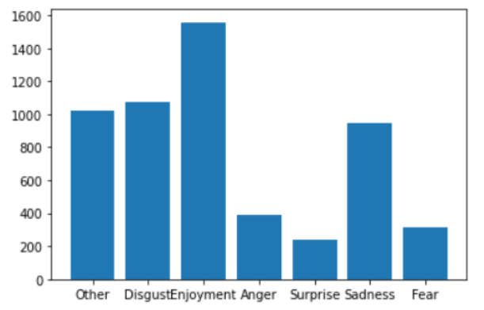

# Data science portfolio 🌌🔭
As a computer science student, my portfolio built for showing off my projects during college.
Some of categories/tags this portfolio includes: Machine Learning, Data Mining, Data Processing, Computer Science.

## Background information

  
  

    
Name: Nguyễn Hoàng Long

    
Birthday: 05/06/2000

    
Phonenumber: 0943628543

    
Email: longenie0506@gmail.com

    
Facebook: HoaÃÄng Long <a href="https://www.facebook.com/Longenie/" target="_blank">facebook.com/Longenie/</a>

    
Education: Ton Duc Thang University <small>Bachelor's degree, Computer Schience, 2018-2022</small>

  

## Content 

#### Autumn 2020 - Deepfake Detection Challenge
Tag: Big data, Data processing, Image processing, Deep learning  
Link of competition: <a href="https://www.kaggle.com/c/deepfake-detection-challenge" target="_blank">this link</a>  
My notebook: <a href="https://www.kaggle.com/longenie/deepfake-detection-with-cnn-model" target="_blank">this link</a>  
Description: Deepfake Detection Challenge is a featured competition, which is held to find deepfake detection techniques dealing with deepfake criminal in future - a way using deeplearning to fake other facial and voice illegally. This is an amateurs project to get used to handle big data, especially image frame. And somewhat get touch with deep learning model - CNN, Mesonet. The notebook is just a copy with available references for research and theory reporting. Our team has no rights for this contribution.

#### Autumn 2020 - Hashing Algorithms in Information Security
Tag: Information Security, Hash, sha256  
Demo run in local device with private usage so as not to have any reference link for this. But chill out, details better.  
Description: SHA256 - “Secure Hash Algorithm 256-bit”, is one of the most common hashing algorithms, a next version of SHA-1, there are so many algorithms in SHA-family. SHA256 gives 256bit long output in 64 characters.  
Our project is implement a tool to generate SHA256 from any text. This is so useful for password hashing or verify networking packages or SSL protocol (ref). This simulate use a public SHA256 ref to demo. Our work is a way more salty, it's apply salt to the SHA256 algorithms just to make "with the same text, we get different hashes", but also have to make sure those hashes always decoded into the same text at first.  
The demo is hosted by Flask framework.

#### Spring 2021 - Vietnamese Chatbot Building
Tag: Chatbot, Natural Language Processing, Machine Learning  
Description: This is a class research project to report student's chatbot from the Vietnamese dataset built by our class too. We use any natural language processing techniques as feature extraction, word segmentation, lemmatizing, vectorize, pos tagging... Some works cool on dataset, some seems not work on Vietnamese dataset.  
We use Vectorizer and classical Classifier to predict simple answer. Lately, we use a technique call word2vec to increase the accuracy and make It way more look-real, but It's stull bag of words or some kind of that, that seems not so "chatbot" after all. LSTM is a somewhat better model for any generating problem. The model is from a reference, thanks to the author. We just need to make my own vocab and process Vietnamese text. It works fine but the most regretful thing is we didnt improve it to later techniques BERT or hybrid system - which is the best nowadays. 

#### Spring 2021 - Vietnamese Comment Classifying
Tag: Natural Language Processing, Datamining, Sentiment Analysis
Description: Another NLP project. Not like chatbot or linguistic analyzing, this session is much more a sentiment analyzing work. We have some comparison between classical model (Naive Bayes, Decision Tree, K-nearest Neighbors) and a kind of Neural Network model (Long-short term memory). These classification models were used for analysing sentiment into classes as  "Disgust", "Enjoyment", "Anger", "Surprise", "Sadness", "Fear". 
The dataset mentioned: <a href="http://nlp.uit.edu.vn/datasets/" target="_blank">UIT-VSMEC (version 1.0) – Vietnamese Social Media Emotion Corpus</a>  
One another small task in this projecct is using datamining techniques to crawl comments, specifically, Vietnamese Youtube Comments crawled with chrome driver. Then we use some dataprocessing techniques to handle those data as: PCA, Feature selection and NLP works. 

#### Spring 2021 - Lane Detection in Image Processing
Tag: Image processing, Lane Detection, OpenCV  
Description: Lane detection is a classical topic that most belongs to image processing. Auto-drive device with lane detection mechanism used for safety check and predict the way to go. In this project we dont have allowance to use any machine learning or generating model to solve the problem, all works have to be based on analyzing image frame-to-fram. OpenCV provides tools for image processing as ROI extraction, Histogram, Colorspace converting...  
This is a single research project. Afterall, we gain so much experience on using tools by OpenCV to process images.  
One of our work is have to apply the techniques to day and night. We would love to improve the project in the future which has rain, people, low light, snow, colorful road...
All the demo and program is privately personal for school reporting.

#### Autumn 2021 - Variational Autoencoder with Probabilistic Layers
Tag: TensorFlow Probability (TFP), Variational Autoencoder, Probablity & Statistic, Machine learning  
Description: Simple schoolwork just for researching one of the TFP features as probilistic layers used in variational autoencoder. Most of the work, we work by single just to know exactly theory and definition that TFP provides.
Application just simple stopped in MNIST dataset, It's better to visualize on any other real dataset to make a fully generate system.
Link of Reference's notebook: <a href="kaggle.com/fazilbtopal/variantional-autoencoders-vae" target="_blank">this link</a> 

#### Autumn 2021 - Differentially Private Machine Learning Training
Tag: Differential Privacy, DPSGD, Machine Learning  
Description: Researchers found that machine learning can also be useful on security problems. When the world is getting harder by the fighter between white and black hat hacker, and informations are much valuable than ever, security then becomes one of the most anxiety think to be improved.  
We have a Collab Notebook but It's a private account so cant be shared but we will show more we have
One of our work is have to apply the techniques to day and night. We would love to improve the project in the future which has rain, people, low light, snow, colorful road...  
Link of the dataset: <a href="https://www.kaggle.com/netflix-inc/netflix-prize-data" target="_blank">this link</a>. So many story around this dataset. We could use this to examine our security techniques, especially, DPSGD.  
By the modifying properties, we can increase the privacy of information, but take care, increase privacy is also decrease data-integrity (means data would loss so much).

#### Autumn 2021 - Twitter Sentiment Analysis Application
Tag: Sentimental Analysis, Twitter, Webapp  
Description: Return to a simple and relaxing project. We developed a webapp on Streamlit hosting framework. Streamlit is a fun framework that helps us to implement data visualization or data application in simplest way. From our first notebook with natural language analysis, we push these repositories into a webapp that gets text and tag to predict sentiment of any tweets.  
The accuracy and functionality are not perfect afterall. We hope to improve it by use Twitter API to read text by URL, and increase trust. Take a look on our web.  
Link of Web: <a href="https://share.streamlit.io/longenie0506/twittersentiment/main/tweetSA.py" target="_blank">this link</a>. Sorry for sometimes It drops due to streamlit limit hosting :( 

#### Autumn 2022 - EMOTIC - Emotion Recognization - Application with Differential Privacy 
Tag: Computer Vision, Emotion Recognization, Differential Privacy
Description: EMOTIC in the reference: EMOTIC (EMOTIons in Context) - Introduced by Kosti et al. in Context Based Emotion Recognition using EMOTIC Dataset. 
A powerful model which mainly focused on emotion recognization through image context. The research proposed an approach to recognize multiple emotions within 26 emotion labels, not just by facial captures. This method is even more reliable, explainable and truthful as it recognizes emotion by body pose and background context. The model consists of two main parts: Body feature extraction (to detect features in the human poses and their emotions) and Image feature extraction (to detect features in the whole background and the emotions conveyed by it). 
We added in SGD algorithm so as to maintain differential privacy, ensuring that the training data images are well-secured..

#### Autumn 2023 - PIX2PIX - A GAN model to generate pixel art from sketches
Tag: Computer Vision, Emotion Recognization, Differential Privacy
Description: The objective of this project is to generate a variety of pixel art from sketches for use in the game industry. 
Due to the lack of available sketch/pixel art data, I built a simple Convolutional Neural Network (CNN) to convert pixel art into color sketches. 
The data generated from the CNN is then used as training data for a Generative Adversarial Network (GAN) to convert simple sketches into complete pixel art. 
Intend to rerun this project to refine the model and achieve more applicable results.

### 2024
Intend to have a long-term computer vision project...

### Thank you for watching my portfolio
I would so much pleasure to receive any message. Don't hesitate to contact to me  💇‍♂️💇‍♀️
